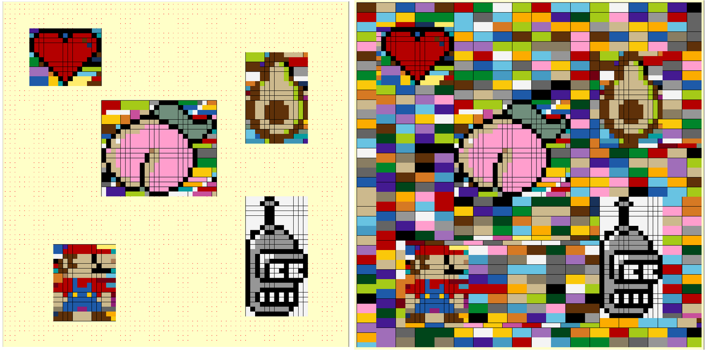

# Lego Mosaic Generator
The goal of this project is to generate a mosaic made with lego pieces. It allows for adding specific designs to our mosaic as well as calculating the quantity of pieces required.

<p align="center">
  <a>
    
  </a>
</p>

## Installation
Run the configuration script to install the required dependencies and initialize the virtual environment. 
```sh
./config.sh
```

## Configuration

All the necessary configuration parameters are found in the **config.json** file. It has two main parts: **"canvas_config"** covers all the information regarding the canvas for the mosaic. **"blocks_per_row"** and **"blocks_per_col"** specify the size in number of bricks. **"valid_pieces"** contains the information regarding the pieces that can be used, and the price for each type of piece, e.g **0.56** DKK.

```json

    "canvas_config": {
        "blocks_per_row": 71,
        "blocks_per_col": 71,
        "valid_pieces": {
            "1x1": {
                "Bright Yellow": 0.56,
                "Bright Yellowish Green": 0.56,
            }
        }
    }

```
The second part of the configuration file covers the information regarding the pixel-art designs that we would like to add to the mosaic. Since most of the designs have a white background, we introduced the control variable **"keep white"** which selects if the white parts of the image are considered when parsing the design. **"size"** defines the size of the designs in pixels/bricks and **"position"** defines the placing of the design in the canvas.

```json
    "designs": {
        "hearth": {
            "path": "./images/designs/pix_art_sample_1.png",
            "keep white": false,
            "size": [
                15,
                12
            ],
            "position": [
                5,
                5
            ]
        }
    }
```

## Usage

In order to generate the mosaic, first make sure that the configuration file has all the necessary information regarding the designs and the Lego pieces that can be used. After this step, run the main file:

```sh
$ source .venv/bin/activate
$ python main.py
```
The first thing that will appear is the **Color Palette** showing the available colors for each available brick. This step aims to double check that the configuration information is correct:
<p align="center">
  <a>
    
  </a>
</p>

The following step is the parsing of the designs, this is, we need to select the bounding box for the design in order to generate the anchor points that will be used to extract the color information and then convert it to Lego bricks. It is important that the number of bricks per row and column is correct, if not, it may cause a misplacement of the anchor points which will cause the parsing of the design to fail.
<p align="center">
  <a>
    
  </a>
</p>


After repeating the previous step for all the designs, the canvas should show them in its desired position. The last step consists on filling the empty part of the canvas with bricks.

<p align="center">
  <a>
    
  </a>
</p>

The resulting mosaic will be saved in **./mosaic.png** and the information regarding the amount of pieces needed will be saved into **./summary.json**. In addition, the estimated price for the mosaic will be printed:

```sh
INFO: The total price for the mosaic is: 1590.0 DKK
INFO: File saved successfully at: ./mosaic.png
```